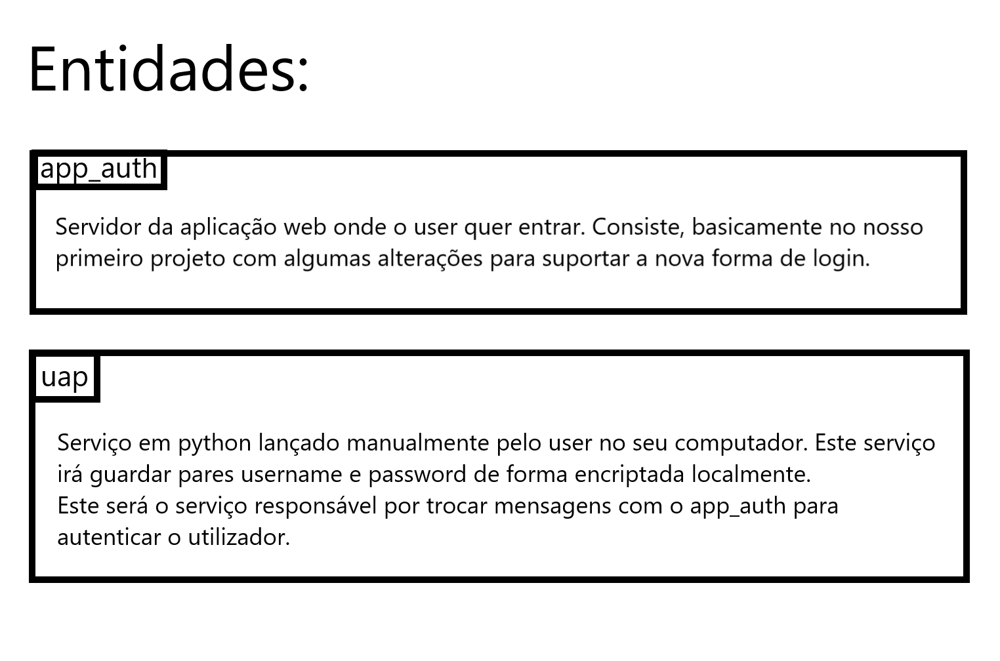
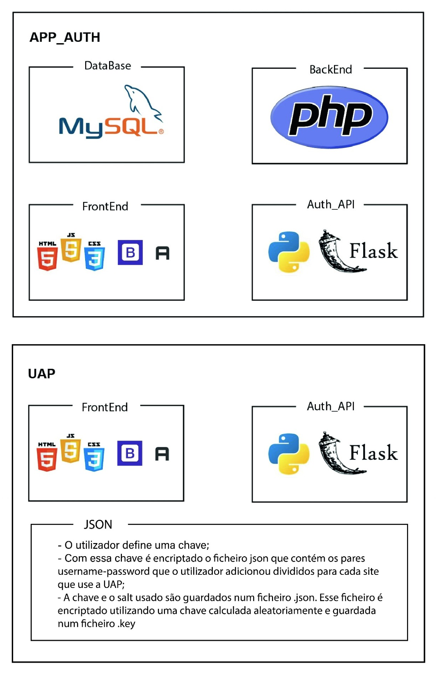
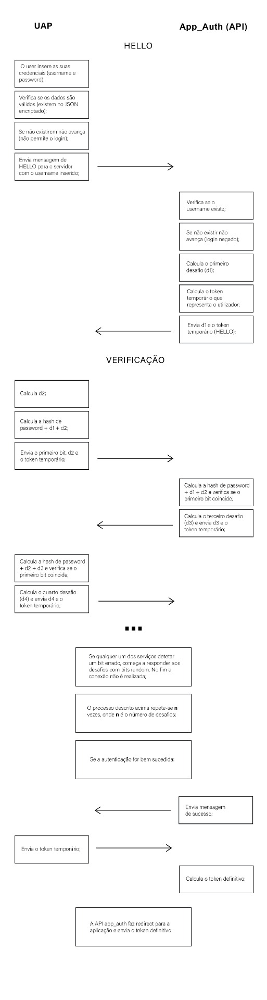

# Authentication

## Descrição:
Este projeto é realizado no âmbito da unidade curricular de [Segurança Informática e nas Organizações](https://www.ua.pt/pt/uc/4143). O objetivo principal do mesmo, é a criação de uma  página para fazer autenticação, utilizando um prótocolo e-chap

## Como correr:
Para correr o projeto terá de libertar as portas: **8000**, **5000**, **3000** e **9874**
```
./run.sh na raiz do projeto
Poderá  ser necessário dar permissões ao ficheiro utilizando chmod

Quando se coloca o projeto a correr vão ser abertos 3 terminais e  uma página web, caso a base de dados ainda 
não tiver sido iniciada totalmente, tanto a api do servidor como a página web ainda não vão estar totalmente 
carregadas e vai haver erros, logo deve aguardar-se a base de dados ficar a correr na totalidade para começar 
a interagir com a apliacação. A base de dados está ligada corretamente quando indicar no terminal que a db 
esta a correr na porta 3306 e está iniciada.
```

## Entidades:


### Constituição


## Protocolo:
<p  align="center">

</p>

## Loggins válidos:
<table>
<tr>
<th align="center">

<p> 
<small>
username
</small>
</p>
</th>
<th align="center">

<p> 
<small>
Password
</small>
</p>
</th>
</tr>
<tr>

<td>
   sobral
</td>
<td>
   sobral
</td>
</tr>
<tr>

<td>
    serras
</td>
<td>
    serras
</td>
</tr>
<tr>

<td>
    goncalo
</td>
<td>
    goncalo
</td>
</tr>
<tr>

<td>
    bernas
</td>
<td>
    bernas
</td>
</tr>
</table>
    
    
## Como é feito a autenticação : 
O utilizador encontra-se na aplicação, SioWiki, e quando não está autenticado possui um botão no lado superior direito que diz Autenticação via UAP, clicando lá passa para a página de login mas já do lado do UAP.
Quando se clica no botão é passado pelo link qual a página que fez a ligação para com a UAP.
A UAP está a correr do lado do cliente  , e  quando o cliente  faz  submite dos dados para se tentar ligar à aplicação o começa a fazer a autenticação.
A UAP sabe de forma dinâmica o link da API app_auth, logo poderá fazer pedidos de várias UAP's para um servidor que esteja remoto (mudando apenas código do lado da app_auth).
Onde primeiro manda a mensagem de hello, primeira mensagem do protocolo descrito em cima. 
      <ul>
     <li>->Caso nesta mensagem de hello seja indicado um utilizador que o servidor da aplicação, SioWiki, conheça o servidor vai fornecer um token temporário para fazer os desafios e o primeiro desafio, este token temporário , corresponde a um conjunto de 10 letras aleatórias que vai identificar o utilizador durante o processo de autenticação e no final este token é apagado, na parte do código em python do servidor, este token vai servir para ser a chave de um dicionário, onde os valores correspondem aos detalhes de um utilizador, detalhes este que é, username, password já com a função de digest, tamanho do resultado da função de digest, quantos desafios já foram feitos e um boolean que verifica se o utilizador já falhou algo.</li>
     <li>->Caso não conheça o utilizador, o servidor vai informar a UAP que não conhece o username indicado e na página de loggin da UAP aparece um warning a indicar que o user não é conhecido. (vai ter de voltar a repetir a inserção dos dados de loggin)</li>
   </ul>
Em caso de ter recebido um token temporário e um desafio, a partir daqui, vai fazer o procedimento indicado  no prótocolo.
No final de ter executado toda a sequência do protocolo surgem 3 alternativas, ou correu tudo bem, ou a password estava incorreta ou o servidor é fictício e está a fazer-se passar por outra pessoa.
<ul>
  <li> ->Caso a password seja incorreta, o servidor verificou durante o processo de autenticação que os bits não correspondem aos certos e desde que notou até ao final esteve a enviar-lhe bits aleatórios e no final em vez de lhe enviar o token para a sua sessão na aplicação, informa-o que a password está incorreta e que deve voltar a inserir os dados, e na página de loggin da UAP é acionado um warning de password incorreta.</li>
  <li> ->Caso o servidor seja ficticio, a UAP verificou durante o processo de autenticação que os bits enviados pelo servidor não corresponde aos certos e desde o momento que nota até ao final, a UAP vai estar a enviar  bits aleatórios ao servidor, e no final quando o servidor lhe der o token de acesso, o que a UAP faz é informar o utilizador que o servidor com que está é ficticio , através de um sweet alert e não avança.</li>
   <li>->Caso seja de sucesso, a UAP recebe um token, o token possui as mesmas caracteristicas que o temporário mas este é para ser usado na aplicação, ou seja, o servidor identifica o utilizador por aquele token durante a sessão na aplicação.</li>
  </ul>
Tendo a UAP o token temporário, o que faz é enviar pelo link onde coloca um parametro ?token_tmp =xxxxxxxxxx, para o servidor e o servidor manda para a aplicação o token final, já com os recursos que devem estar associados ao loggin, para o utilizador indicado.
Salientar que o token é só para uma sessão a partir do momento que é feito o logout, colocar o token no link já não serve de nada, pois quando é feito o logout aquele token para de estar associado ao user sendo necessário voltar a repetir todo o processo de autenticação.
Por último, do lado do php, temos uma variável de sessão para identificar qual a página para onde devemos ser redirecionados, isto é, se o utilizador foi fazer a autenticação quando estava numa publicação, quando acabar de fazer a autenticação vai voltar a página dessa publicação.

Para remover a base de dados de login's e os respetivos ficheiros associados é recomendado executar o ficheiro *clean.sh*.
